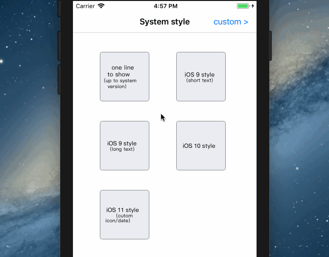

查看中文文档 [Chinese README.md](/README_CHS.md)

Email：pikacode@qq.com

QQ群: 345192153


# EBBannerView

Only one line to show:

- a banner the same style as iOS Push Notifications (auto show iOS 9/10/11 styles up to system version)
- auto play a sound or vibrate when the banner is showing


- iOS 9 style support swipe down gesture for a long text

And more：

- custom banner's icon/title/date/content/animation_time_interval
- custom the sound (use system sound or play a sound file)


- autosize portrait/landscape frame
- show a custom view with different frame in portrait/landscape
- custom view has different animation mode, appear from top/left/right/left/center


- NSNotification with click event and pass a value


## Screenshot

### System style:

  


### Custom style:

  


## Installation

### pod

	target 'YourTargetName' do
	  pod 'EBBannerView'
	end


## Usage


### System style

---

```objc
#import <EBBannerView.h>
```

2 ways to use:


#### 1.Show a iOS style banner with one line

up to system version，will show iOS 9/10/11 style，auto show app icon/name.

```objc
[EBBannerView showWithContent:@"custom content"];
```


#### 2.Customize all values include iOS style

```objc
//1.create a banner, custom all values
EBBannerView *banner = [EBBannerView bannerWithBlock:^(EBBannerViewMaker *make) {
    make.style = EBBannerViewStyleiOS9;//custom system, default is current
    //make.style = 9;
    make.content = @"MINE eye hath played the painter and hath stelled";
    //make.object = ...
    //make.icon = ...
    //make.title = ...
    //make.soundID = ...
}];
 
//2.show
[banner show];
```


##### Parameters: 

(if not set will use default values)

- `style`：the iOS style, default is `UIDevice.currentDevice.systemVersion.intValue`, type enum : NSInteger {9/10/11}
- `icon`：the icon, default is app icon, type UIImage
- `title`：the title, default is app name, type NSString
- `date`：the date, default is localized string @"现在" =  @"now", type NSString
- `content`：the content, type NSString
- `animationDuration`：the animation time(show/hide the banner), type NSTimeInterval
- `stayDuration`：how long the banner will stay before hide, type NSTimeInterval
- `object`：you can set it when create, then get it when clicked by adding an observer (see below), default is `content`，type id
- `soundID`：the sound will play when the banner is showing (when the mute is turn on iPhone will vibrate), type UInt32

  - it's iOS system sound id, default push notification sound "Tritone" is 1312
  - More sound id to see here [iOS Predefined sounds](http://iphonedevwiki.net/index.php/AudioServices#) or here [AudioServices sounds](http://www.cocoachina.com/bbs/read.php?tid=134344)

  - You can download all the system sounds [UISounds.zip](/UISounds.zip) , listen and choose one which you perfer, then check out it's `id` with the form above
- `soundName`：play a cusome sound file, type NSString
  - drag the file to Xcode proj
  - pass the file name and extension，e.g. `banner.soundName = @"sound.mp3"` 


### Custom style

---

```objc
#import <EBCustomBannerView.h>
```

2 ways to use:


#### 1.create and show immediately

```objc
UIView *view = ...;//the view want to show

[EBCustomBannerView showCustomView:view block:^(EBCustomBannerViewMaker *make) {
    make.portraitFrame = ...;//frame in portrait
    make.portraitMode = EBCustomViewAppearModeTop;//appear from top in portrait
    make.soundID = 1312;
    make.stayDuration = 3.0;
    //......
}];
```


#### 2.create and show after

```objc
UIView *view = ...;//the view want to show

//1.
EBCustomBannerView *customView = [EBCustomBannerView customView:view block:^(EBCustomBannerViewMaker *make) {
    make.portraitFrame = ...;
    make.portraitMode = EBCustomViewAppearModeTop;
    make.soundID = 1312;
    make.stayDuration = 3.0;
    //......
}];

//2.
[customView show];
//[customView hide];
```


##### Parameters:

- `portraitFrame`:  frame in portrait，default is view.frame，type CGRect
- `landscapeFrame`: frame in landscape，default is view.frame，type CGRect
- `soundID`: (the same as `system style`'s)
- `soundName`: (the same as `system style`'s)
- `animationDuration`: (the same as `system style`'s)
- `stayDuration`: (the same as `system style`'s)
- `portraitMode`: in portrait view appears from top/bottom/left/right/center, default is top, type enum
- `landscapeMode`: in landscape view appears from top/bottom/left/right/center, default is top, type enum
- `centerModeDurations`: the animation time of view appears from center, default is @[@0.3, @0.2, @0.1],  `animationDuration` is invalid for center animation


## Handle click event and pass value (system style)

- add an observer for `EBBannerViewDidClickNotification` and handle click event
- pass an object when init the banner, and get it when clicked

```objc
#import <EBBannerView.h>
{...
    EBBannerView *banner = [EBBannerView bannerWithBlock:^(EBBannerViewMaker *make) {
        ...
        make.object = aObject;
        ...
    }];
...}

{...
    [[NSNotificationCenter defaultCenter] addObserver:self selector:@selector(bannerViewDidClick:) name:EBBannerViewDidClickNotification object:nil];
...}

-(void)bannerViewDidClick:(NSNotification*)noti{
    NSLog(@"%@",noti.object);
}
```
